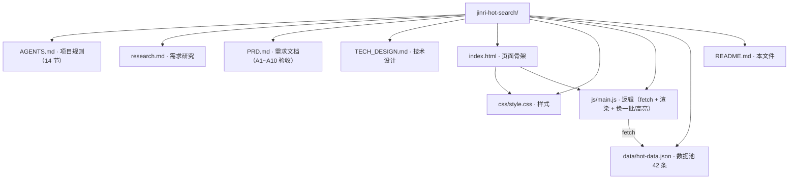

# 今日热搜（jinri-hot-search）

每天最热的事，一页看完。

- **在线访问**：<https://xingho-vibecoding.github.io/jinri-hot-search/>
- 作者：张光如（[@709QR](https://github.com/709QR)）
- 所属：XingHo-VibeCoding · 30 天建站训练营 · 第 1 周
- 项目规则：见 [AGENTS.md](AGENTS.md)

## 本地运行（Day 7 存档）

在仓库根目录执行：

```bash
python -m http.server 8000
```

然后浏览器打开 <http://localhost:8000>。

> ⚠️ 不要直接双击 `index.html` 用 `file://` 打开——浏览器会因 CORS 限制拦截 `fetch` 读取本地 JSON，页面会显示错误提示。这不是 bug，必须走本地服务器（原因见 [TECH_DESIGN.md](TECH_DESIGN.md) 配套决策）。

停止服务器：终端按 `Ctrl+C`。

## 项目结构（Day 7 余力加练）



## 进度

- Day 1：装齐环境（WorkBuddy / Git / Node.js / GitHub），建工作区，存 AGENTS.md
- Day 2：建 GitHub 仓库，首次提交（index.html 占位页 + .gitignore）
- Day 3：需求研究（research.md）
- Day 4：产品需求文档（PRD.md，含 A1~A10 验收标准）
- Day 5：技术设计（TECH_DESIGN.md，技术路线 + 数据流图）+ MVP 首页开发（F1~F4 全实现）
- Day 6：完善 AGENTS.md（6 节扩到 14 节，补录越界规则 + 队友检查项 + 协作过程规则）
- Day 7：MVP 运行验收（本地启动 + A1~A10 自检 + 运行说明存档）
