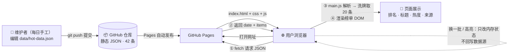

# TECH_DESIGN.md — 今日热搜 技术设计

> Day 5 产出 · 作者：张光如（709QR） · 2026-09-22
> 上游文档：[PRD.md](PRD.md)（本文只回答「怎么做」，不改变「做什么」）

## 技术路线（一句话）

**原生 HTML / CSS / JavaScript 三件套 + 静态 JSON 数据文件 + GitHub Pages 托管——零框架、零构建工具，Day 23 数据库化时只需把 `js/main.js` 里的 fetch 地址从静态文件换成接口，页面和数据字段结构都不动。**

## 为什么是这条路（有理由，不是拍脑袋）

候选方案对比（3 个）：

| 维度 | A：原生三件套 + 静态 JSON ✅ | B：Vue 3（CDN 引入） | C：React + Vite 构建链 |
|---|---|---|---|
| 上手/调试成本 | 零依赖，写完即跑 | 低，但要理解响应式概念 | 高：node、npm、打包配置一套流程 |
| 首屏速度（对 A2） | 天然最优：无框架加载、无构建产物膨胀 | 需加载 ~130KB 框架代码 | 构建后可控，但多一层工具链变量 |
| 与 PRD 功能匹配度 | 一次渲染 + 换一批重渲染，手写 DOM 完全够用 | 响应式更新有优势，但本页只有两次渲染场景 | 同 B，收益更小 |
| 第 1 周能力圈 | 完全在圈内 | 边缘 | 圈外（学习成本会吃掉开发时间） |
| Day 23 数据库化衔接 | 只换数据来源，页面不动 | 同样只换数据来源 | 同样只换数据来源 |
| 风险 | 手动 DOM 更新繁琐（但场景简单，可控） | CDN 依赖网络，离线调试不便 | 工具链出问题会卡死整个第 1 周 |

**选 A 的核心理由**：PRD 只有 1 个页面、4 个功能、42 条静态数据——框架在这种规模下收益趋近于零，而工具链风险是实打实的。A2 要求测试条件下 3 秒首屏，原生方案是唯一「不努力也达标」的选项。

## 数据流图：数据从哪来、到哪去

**用一句话读这张图**：数据由维护者每日手工写进 `data/hot-data.json`，经 git push 进入 GitHub 仓库、由 Pages 分发给浏览器；`main.js` 用 fetch 拉取后洗牌取 20 条渲染成榜单；用户的「换一批 / 高亮」操作只改浏览器内存里的状态，**不回写任何数据源**。Day 23 数据库化时，整条链路只替换「GitHub 仓库里的静态 JSON」这一段为数据库接口，前后两端都不用动。

## 配套决策

| 事项 | 决策 | 说明 |
|---|---|---|
| 数据方案 | 静态 JSON：`data/hot-data.json`，页面 fetch 读取 | 字段与 PRD 第 5 节一致；已准备 42 条演示数据验证可行性；Day 23 只把数据来源换成数据库接口，字段结构不变 |
| 页面部署 | GitHub Pages | 推送 main 即自动发布，免费、零配置，Day 7 上线用它 |
| 本地预览 | `python -m http.server 8000` | **坑位预警**：浏览器禁止 `file://` 页面 fetch 本地文件（CORS 限制），本地看效果必须走本地服务器，这不算 bug |
| 样式方案 | 手写 CSS，单文件 | 单页不需要 Tailwind/Bootstrap，引框架反而拖慢 A2 |
| 换一批算法 | 数据池随机洗牌后取前 20 条 | 高亮按标题匹配跟随条目（PRD F2） |

## 方案变化影响表（哪些文件会跟着动）

| 如果方案变成… | 受影响文件 | 不受影响 |
|---|---|---|
| 数据来源：静态 JSON → 数据库接口 | `js/main.js`（仅 fetch 地址） | index.html、css、数据字段结构 |
| UI 框架：原生 → Vue / React | `index.html`、`js/main.js` 全部重写 | data/hot-data.json、PRD 功能定义 |
| 加深色模式 | `css/style.css` | JS 逻辑、数据文件 |
| 部署：GitHub Pages → Vercel / 自有服务器 | 无（纯静态，零改动） | 全部文件 |
| 数据字段增加（如条目链接） | `data/hot-data.json` + `js/main.js` + README 示例 | css、index.html 骨架 |

> 这张表的意义：改动面越小，说明当初的分层（数据 / 结构 / 样式 / 逻辑分离）越合理——「换数据库只动一行 fetch」就是 Day 23 的保险。

## 风险与降级

| 风险 | 预案 |
|---|---|
| fetch 读取 JSON 失败 | 页面显示明确错误提示，不白屏 |
| 375px 移动端表格溢出 | 榜单用弹性布局而非 `<table>`，媒体查询下调字号 |
| GitHub Pages 当天开通延迟 | 本地服务器演示兜底，Pages 顺延不阻塞验收 |

## 后续

- Day 5~6：按 F1~F4 开发（index.html + css/ + js/）
- Day 7：按 PRD A1~A10 验收
