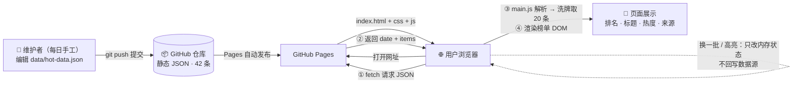

# TECH_DESIGN.md — 今日热搜 技术设计

> Day 5 产出 · 作者：张光如（709QR） · 2026-09-22
> 上游文档：[PRD.md](PRD.md)（本文只回答「怎么做」，不改变「做什么」）

## 技术路线（一句话）

**原生 HTML / CSS / JavaScript 三件套 + 静态 JSON 数据文件 + GitHub Pages 托管——零框架、零构建工具，Day 23 数据库化时只需把 `js/main.js` 里的 fetch 地址从静态文件换成接口，页面和数据字段结构都不动。**

## 为什么是这条路（有理由，不是拍脑袋）

候选方案对比（3 个）：

| 维度 | A：原生三件套 + 静态 JSON ✅ | B：Vue 3（CDN 引入） | C：React + Vite 构建链 |
|---|---|---|---|
| 上手/调试成本 | 零依赖，写完即跑 | 低，但要理解响应式概念 | 高：node、npm、打包配置一套流程 |
| 首屏速度（对 A2） | 天然最优：无框架加载、无构建产物膨胀 | 需加载 ~130KB 框架代码 | 构建后可控，但多一层工具链变量 |
| 与 PRD 功能匹配度 | 一次渲染 + 换一批重渲染，手写 DOM 完全够用 | 响应式更新有优势，但本页只有两次渲染场景 | 同 B，收益更小 |
| 第 1 周能力圈 | 完全在圈内 | 边缘 | 圈外（学习成本会吃掉开发时间） |
| Day 23 数据库化衔接 | 只换数据来源，页面不动 | 同样只换数据来源 | 同样只换数据来源 |
| 风险 | 手动 DOM 更新繁琐（但场景简单，可控） | CDN 依赖网络，离线调试不便 | 工具链出问题会卡死整个第 1 周 |

**选 A 的核心理由**：PRD 只有 1 个页面、4 个功能、42 条静态数据——框架在这种规模下收益趋近于零，而工具链风险是实打实的。A2 要求测试条件下 3 秒首屏，原生方案是唯一「不努力也达标」的选项。

## 数据流图：数据从哪来、到哪去

**用一句话读这张图**：数据由维护者每日手工写进 `data/hot-data.json`，经 git push 进入 GitHub 仓库、由 Pages 分发给浏览器；`main.js` 用 fetch 拉取后洗牌取 20 条渲染成榜单；用户的「换一批 / 高亮」操作只改浏览器内存里的状态，**不回写任何数据源**。Day 23 数据库化时，整条链路只替换「GitHub 仓库里的静态 JSON」这一段为数据库接口，前后两端都不用动。

**数据不会去的地方**（反向声明，和「到哪去」同等重要）：

| 去处 | 状态 | 说明 |
|---|---|---|
| 后端服务器 | **没有** | 本期零后端，页面纯静态 |
| 数据库 | **Day 23 前没有** | 42 条数据住在仓库里的 JSON 文件中 |
| 第三方接口 | **不引** | 数据手工维护，页面不请求任何外部 API |
| 浏览器本地存储 | **不写** | localStorage/cookie 一概不用，高亮状态刷新即失，属可接受代价 |
| 用户上传 | **不存在** | 页面无任何输入入口，用户是纯读者 |

## 配套决策

| 事项 | 决策 | 说明 |
|---|---|---|
| 数据方案 | 静态 JSON：`data/hot-data.json`，页面 fetch 读取 | 字段与 PRD 第 5 节一致；已准备 42 条演示数据验证可行性；Day 23 只把数据来源换成数据库接口，字段结构不变 |
| 页面部署 | GitHub Pages | 推送 main 即自动发布，免费、零配置，Day 7 上线用它 |
| 本地预览 | `python -m http.server 8000` | **坑位预警**：浏览器禁止 `file://` 页面 fetch 本地文件（CORS 限制），本地看效果必须走本地服务器，这不算 bug |
| 样式方案 | 手写 CSS，单文件 | 单页不需要 Tailwind/Bootstrap，引框架反而拖慢 A2 |
| 换一批算法 | 数据池随机洗牌后取前 20 条 | 高亮按标题匹配跟随条目（PRD F2） |

## 方案变化影响表（哪些文件会跟着动）

| 如果方案变成… | 受影响文件 | 不受影响 |
|---|---|---|
| 数据来源：静态 JSON → 数据库接口 | `js/main.js`（仅 fetch 地址） | index.html、css、数据字段结构 |
| UI 框架：原生 → Vue / React | `index.html`、`js/main.js` 全部重写 | data/hot-data.json、PRD 功能定义 |
| 加深色模式 | `css/style.css` | JS 逻辑、数据文件 |
| 部署：GitHub Pages → Vercel / 自有服务器 | 无（纯静态，零改动） | 全部文件 |
| 数据字段增加（如条目链接） | `data/hot-data.json` + `js/main.js` + README 示例 | css、index.html 骨架 |

> 这张表的意义：改动面越小，说明当初的分层（数据 / 结构 / 样式 / 逻辑分离）越合理——「换数据库只动一行 fetch」就是 Day 23 的保险。

## 风险与降级

| 风险 | 预案 |
|---|---|
| fetch 读取 JSON 失败 | 页面显示明确错误提示，不白屏 |
| 375px 移动端表格溢出 | 榜单用弹性布局而非 `<table>`，媒体查询下调字号 |
| GitHub Pages 当天开通延迟 | 本地服务器演示兜底，Pages 顺延不阻塞验收 |

## 后续

- Day 6：自查 + 打磨（F1~F4 代码已于 Day 5 早前提交完成）
- Day 7：按 PRD A1~A10 验收

## Day 5 收尾对照表（逐项证据）

| 项 | 状态 | 证据 |
|---|---|---|
| 主任务：TECH_DESIGN.md | ✅ 已完成 | 提交 `da499e4`（文档主体）+ 本提交（反向声明 + 本表），全文 0~10 节 |
| 主任务：数据流图 | ✅ 已完成 | 第 4 节 mermaid 图：维护者 → 仓库 → Pages → 浏览器 5 节点链路 |
| 完成标准① 文档已入库 | ✅ 已完成 | API 推送脚本断言「远端 main == 本地 HEAD」后才算成功，`git ls-remote` 可复核 |
| 完成标准② 技术路线有理由 | ✅ 已完成 | 第 3 节 A/B/C 三方案六维对比 + 选 A 核心理由（规模 + A2 首屏） |
| 完成标准③ 说清从哪来、到哪去 | ✅ 已完成 | 第 4 节：手工 JSON → git push → Pages → fetch → 渲染榜单，交互不回写 |
| 板块① 前后端与数据库分工 | ✅ 已完成 | 「数据不会去的地方」表：本期无后端、无数据库，Day 23 才加接口 |
| 板块② 技术路线生成 | ✅ 已完成 | 第 2 节一句话路线 + 第 3 节理由落点 |
| 板块③ 数据流图 | ✅ 已完成 | 第 4 节 mermaid 图 + 读图一句话 + 反向声明 |
| 余力加练：方案变化影响表 | ✅ 已完成 | 第 6 节：换数据库只动 `js/main.js` 一处 fetch 地址 |
| 余力加练：技术栈科普 | ✅ 已完成 | 工作区学习素材（不入库）：网页/App 技术分层 + 本项目技术栈定位 |
| 今日不做：写代码 | 🛡️ 守住了 | 本次提交仅 `.md` 文档，未动任何代码文件（功能代码为 Day 5 早前提交完成） |
| 今日不做：回头大改 PRD | 🛡️ 守住了 | `PRD.md` 零改动，不在本次提交里 |
| 卡住降级 | ➖ 未触发 | 正常路线完成，未启用「示范路线」降级方案 |

## 11. Day 8 主视图迭代：四种页面状态 + 可复用卡片组件

**一句话生成页面（板块①）**：一个无需登录的单页热搜榜——打开就看到今日 20 条热点卡片，按热度排名，点「换一批」随机刷新，点条目标记已看。

### 11.1 四种页面状态处理表

| 状态 | 什么时候出现 | 页面表现 | 实现 |
|---|---|---|---|
| 加载中 | fetch 请求发出到数据返回之间 | 5 张骨架占位卡片 + 微光扫过动画 | `#loading` 骨架屏 |
| 空 | 请求成功但数据池 0 条 | 虚线框 + 「今天还没有热点数据」提示 | `#empty` 空状态块 |
| 错误 | 请求失败（HTTP 非 200 / file:// 被 CORS 拦） | 红色错误条 + 具体原因 + 重试按钮 | `#error` + `#retryBtn` |
| 正常 | 数据就绪 | 20 条热搜卡片榜单 | `#list`（Day 5 原有） |

调度规则：`showState(name)` 统一切换，同一时刻只显示一种（`js/main.js`）。

### 11.2 可复用组件（余力加练）

`js/components.js` 暴露 `HotCard.create(item, idx, opts)` 和 `HotCard.renderList(el, items, opts)`：组件不知道数据从哪来，只负责「一条数据 → 一张卡片」，mock 数据（本期）和真实 API（Day 23）都能直接喂给它。`main.js` 因此只剩状态调度和交互逻辑。

### 11.3 数据流变化：不增加任何新去向

本期改的只是**同一份数据的展示过程**：`data/hot-data.json` → fetch → 状态判断 → 渲染。数据仍然不会去的地方：无后端、无数据库、无 localStorage、无任何上报——与 Day 5 反向声明一致。

### Day 8 收尾对照表（逐项证据）

| 项 | 状态 | 证据 |
|---|---|---|
| 主任务：生成并运行主视图（mock 数据版） | ✅ 已完成 | `index.html` + `js/main.js` 重构，本地 `http://localhost:8000` 打开即渲染 20 条卡片 |
| 板块① 一句话生成页面 | ✅ 已完成 | 11 节开头一句话；页面按一句话逐条落地（榜单/排名/换一批/已看） |
| 板块② 本地运行 | ✅ 已完成 | `python -m http.server 8000`，浏览器截图含地址栏 localhost:8000 |
| 板块③ mock 数据渲染 | ✅ 已完成 | 列表与卡片由 `data/hot-data.json`（42 条演示数据）渲染，页脚显示数据池条数 |
| 完成标准① 页面本地能打开 | ✅ 已完成 | localhost:8000 返回 200，页面无 JS 报错（见控制台与截图） |
| 完成标准② 列表和卡片用本地假数据渲染 | ✅ 已完成 | 卡片由 `HotCard.renderList` 生成，数据源为本仓库 `data/hot-data.json` |
| 完成标准③ 改动已提交 | ✅ 已完成 | 见 Day 8 提交（git log 可查），API 推送断言远端 main == 本地 HEAD |
| 思考题：哪种状态最容易被忽略 | ✅ 已回答 | 打卡文案：空状态（理由见打卡） |
| 今日不做：接真实 API | 🛡️ 守住了 | 全程无任何真实接口请求，唯一 fetch 指向本地 `data/hot-data.json` |
| 今日不做：加登录 | 🛡️ 守住了 | 无任何登录/鉴权代码，一句话里明确「无需登录」 |
| 余力加练：可复用组件 | ✅ 已完成 | 新增 `js/components.js`（HotCard.create / renderList） |
| 卡住降级：只完成静态数据版 | ➖ 未触发 | 正常路线完成，四态全部实现，未降级 |
